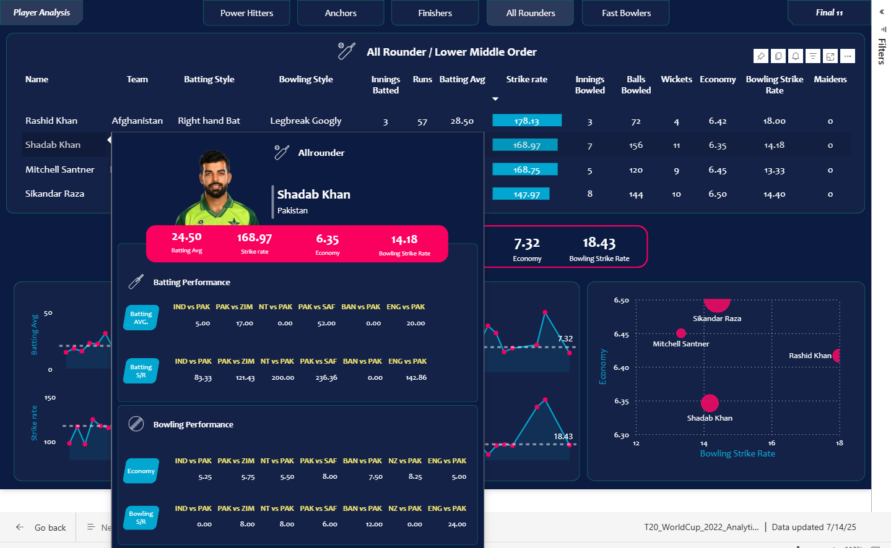

# 🏏 Cricket T20 World Cup 2022 Data Analysis

## Overview
Built an end-to-end pipeline to select the best 11 players from the T20 World Cup 2022 using:

- Web scraping (Bright Data + ESPN Cricinfo)  
- Data transformation (Python & Pandas)  
- Interactive dashboard (Power BI)

## Tools Used
- Bright Data  
- Python & Pandas  
- Power BI (DAX & Power Query)  

---
## Dashboard Screenshots

### Player Hover Popups
| Batsman View | Bowler View | All-Rounder View |
|:--:|:--:|:--:|
|  |  |  |

### Openers / Power Hitters
| Top Openers Statistics | Selected Openers Statistics |
|:--:|:--:|
|  |  |

### Anchors / Middle Order
| Top Anchors Statistics | Selected Anchors Statistics |
|:--:|:--:|
|  |  |

### Finishers
| Top Finishers Statistics | Selected Finishers Statistics |
|:--:|:--:|
|  |  |

### All-Rounders
| Top All-Rounders Statistics | Selected All-Rounders Statistics |
|:--:|:--:|
|  |  |

### Fast Bowlers
| Top Fast Bowlers Statistics | Selected Fast Bowlers Statistics |
|:--:|:--:|
|  |  |

### Final 11 Team Selection
| Selected Final XI - Top Order | Selected Final XI - Lower Order |
|:--:|:--:|
|  |  |

---
## Player Role Criteria

**Openers:** Avg > 30 | SR > 140 | Inns > 3 | Boundary % > 50 | Batting Pos < 4  
**Anchors:** Avg > 40 | SR > 125 | Inns > 3 | Balls Faced > 20 | Batting Pos > 2  
**Finishers:** Avg > 25 | SR > 130 | Inns > 3 | Balls Faced > 12 | Batting Pos > 4 | Bowling Inns > 1  
**All-Rounders:** Batting Avg > 15 | SR > 140 | Bowling Inns > 2 | Economy < 7 | Bowling SR < 20  
**Fast Bowlers:** Bowling Inns > 4 | Economy < 7 | Bowling SR < 16 | Style = "Fast" | Dot Ball % > 40

## Dashboard Highlights
- Player stat popups on hover  
- Filters by roles (Openers, Anchors, etc.)  
- KPI-based shortlisting  
- Final 11 team view